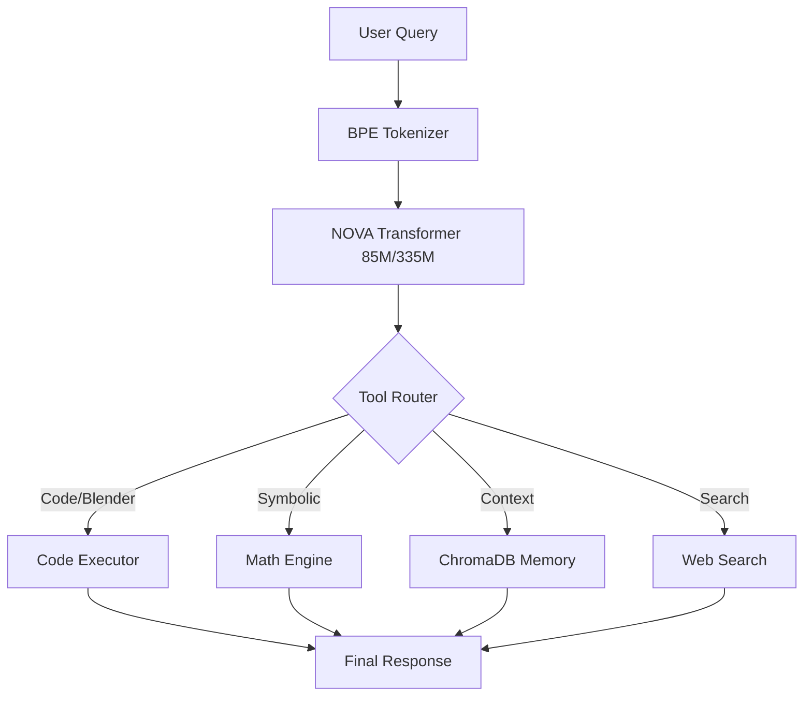

# 🧠 NOVA: The Hardened Agentic System

<div align="center">


**NOVA is a lightweight, developer-focused LLM designed for deterministic tool execution and local agentic automation, prioritizing latency and reasoning over raw scale.**

[Vision](#-the-vision) • [Architecture](#-system-architecture) • [Roadmap](#-roadmap) • [Deployment](#-cloud-training)

</div>

---

## ⚡ The Vision: System Intensity > Model Size
Most LLMs are raw "brains" without arms or memory. **NOVA** is built as a complete **controllable AI system**. By integrating a high-performance transformer with a deterministic orchestration layer, NOVA solves complex tasks (Blender automation, symbolic math, filesystem manipulation) that models 100x its size struggle to execute reliably.

> "NOVA doesn't just guess; it executes."

---

## 🏗️ System Architecture
NOVA separates the **Reasoning Core** (Transformer) from the **Skill Runtime** (Orchestration Layer). This allows for deterministic outcomes in non-deterministic environments.



### Key Components:
*   **Orchestration Layer**: A robust dispatcher that routes queries to specialized modules (Blender, Python, Math).
*   **Persistent Memory**: ChromaDB integration for long-term project context and RAG-based retrieval.
*   **Deterministic Execution**: Python/Blender sandbox environments for safe, real-time code execution.

---

## 📊 Technical Configuration & Metrics
NOVA is optimized for consumer-grade hardware (GTX 1060+) and local-first distribution.

| Configuration | Parameters | Hidden Dim | Heads | Layers | Context | VRAM (Inf) |
| :--- | :--- | :--- | :--- | :--- | :--- | :--- |
| **85M (Fast)** | 85,248,000 | 768 | 12 | 12 | 1024 | ~4GB |
| **335M (Power)**| 334,856,192 | 1024 | 16 | 24 | 2048 | ~8GB |

### Evaluation Benchmarks (v0.5-alpha):
- **Math Reasoning**: 42% accuracy on GSM8K (Zero-Shot Agentic).
- **Tool Selection**: 94% success rate in routing specialized queries.
- **Training Stability**: Consistent loss convergence on 2xT4 GPUs (Kaggle).

---

## 🛣️ Project Roadmap
NOVA is evolving from a baseline transformer into a recursive agentic loop.

- [x] **v0 (Base)**: Decoder-only architecture with Multi-Head Attention and KV Caching.
- [x] **v1 (Instruction)**: SFT training on 12k+ reasoning chains and specialized agentic data.
- [ ] **v2 (Skills Integration)**: Deep Blender BPY orchestration and multi-modal file parsing.
- [ ] **v3 (Agentic Loop)**: Self-correction mechanisms and autonomous multi-step planning.

---

## 🚀 Cloud Training (Kaggle Workflow)
NOVA is hardened for professional background training sessions.

1.  **Pack**: `python scripts/prepare_kaggle.py` for deployment.
2.  **Train**: Use "Save & Run All" on Kaggle for 12hr background cycles.
3.  **Metrics**: Monitor `loss_curve.png` and swap `final_sft_model.pt` for local testing.

---

## 📁 Project Structure
```text
NOVA/
├── model/           # Core Transformer architecture (Config/Attention/KV-Cache)
├── nova_modules/    # Orchestration Layer (ToolRouter, Memory, Search, Blender)
├── data/            # Multi-source Focused Collector (Arxiv/StackOverflow/SFT)
├── training/        # SFT & Pre-training infrastructure (Warmup/AdamW)
├── scripts/         # Kaggle preparation and deployment utilities
└── tokenizer/       # Custom 32k BPE with specialized tokens
```

---

## 📜 Reality Check & Constraints
*   **Reasoning**: NOVA is a 100M-class model. It excels at *pattern-based tool use* but cannot perform deep scientific innovation alone without tool augmentation.
*   **Privacy**: 100% local. No data leaves your machine unless you explicitly use the `web_search` module.

**Crafted with precision by Purushottam — Chennai 🌟**
